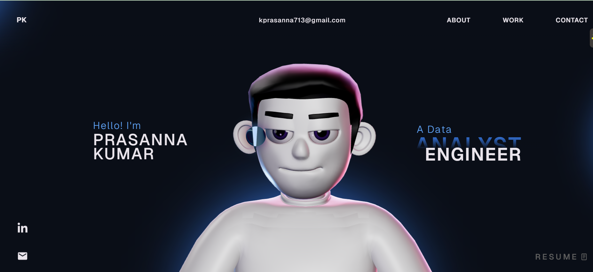

<div align="center">

[](https://git.io/typing-svg)

</div>

<br/>

<div align="center">
  <a href="https://kprasanna713.github.io/prasanna-portfolio/" target="_blank">
    
  </a>&nbsp;
  <a href="https://www.linkedin.com/in/prasanna-kumar-750990181/" target="_blank">
    
  </a>&nbsp;
  <a href="mailto:kprasanna713@gmail.com">
    
  </a>
</div>

<br/>


##  About Me

```python
class DataAnalyst:
    def __init__(self):
        self.name = "Prasanna Kumar Vechha"
        self.role = "Data Analyst @ BMW Group"
        self.location = "Oxford, UK"
        self.education = "MSc Engineering Business Management – University of Exeter"

    def skills(self):
        return {
            "languages":    ["Python", "SQL", "R"],
            "bi_tools":     ["Power BI", "Tableau", "QuickSight", "SSRS"],
            "cloud":        ["AWS S3", "Athena", "Lambda", "Redshift"],
            "ml_ai":        ["Scikit-learn", "PyTorch", "LangChain", "Pandas", "NumPy"],
            "databases":    ["MySQL", "Snowflake", "SAP"],
            "other":        ["ETL/ELT Pipelines", "Data Warehousing", "API Integration"]
        }

    def current_focus(self):
        return "Building GenAI solutions & automating business intelligence at scale"
```


##  Tech Stack

<div align="center">

### Data & Analytics


### BI & Visualization


### Cloud & Infrastructure


### Web & Portfolio


</div>


##  Featured Projects

<div align="center">

| | Project | Impact | Tools |
|---|---------|--------|-------|
|  | **BMW Logistics KPI Automation** | Enabled self-service data access for 50+ users, reduced manual reporting by 50% | `SQL` `Power BI` `AWS` `SAP` |
|  | **£1.5M Cost Recovery Analytics** | Identified revenue leakage through root-cause analysis, contributing to £1.5M recovery | `SQL` `Power BI` `Python` |
|  | **Self-Service AI Chatbot** | Deployed GenAI chatbot for warehouse managers to query data in plain English | `Python` `AWS Athena` `LangChain` `Pandas` |
|  | **Warehouse Stock Optimization** | Optimized inventory levels using clustering and time-series forecasting | `Python` `K-Means` `SAP` |

</div>


##  Portfolio Preview

<div align="center">
  <a href="https://kprasanna713.github.io/prasanna-portfolio/" target="_blank">
    
  </a>

  <br/><br/>

  <a href="https://kprasanna713.github.io/prasanna-portfolio/" target="_blank">
    
  </a>
</div>

<br/>

> **Built with** React + TypeScript + Three.js + GSAP — featuring interactive 3D elements, smooth scroll animations, and WebGL effects.


##  GitHub Analytics

<div align="center">
  
  
</div>

<div align="center">
  
</div>

<br/>

<div align="center">

[](https://github.com/ryo-ma/github-profile-trophy)

</div>


<div align="center">

  

  <br/><br/>

  *"Without data, you're just another person with an opinion."* — W. Edwards Deming

</div>


